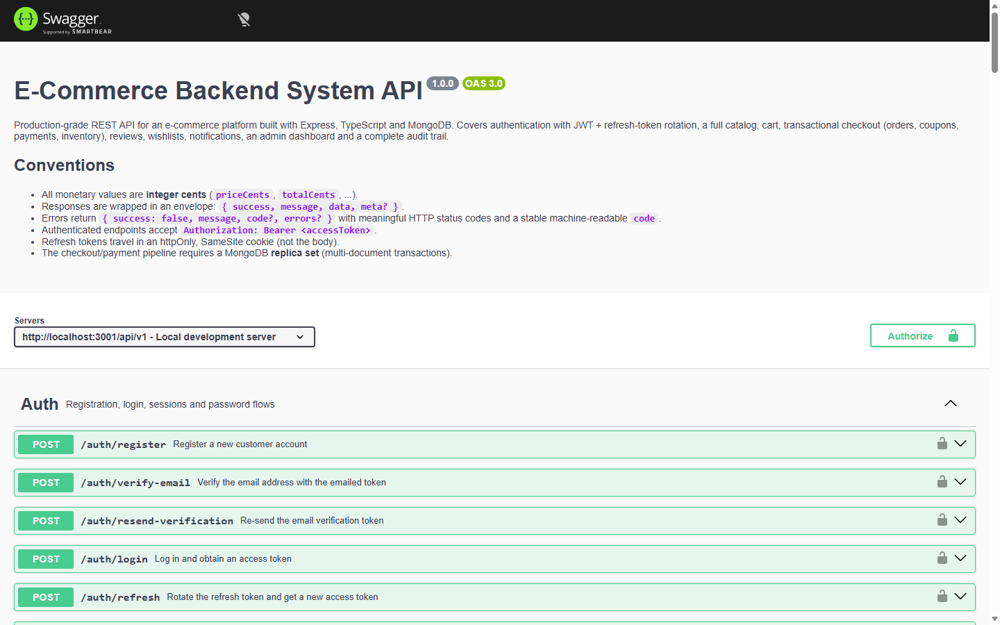
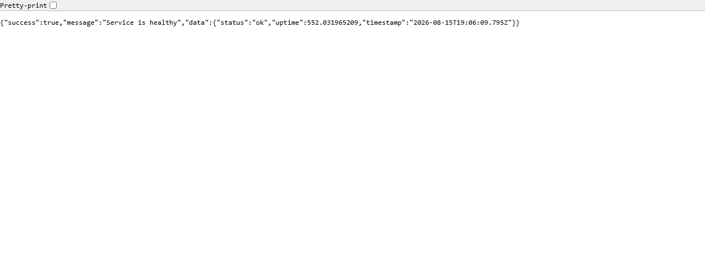

<div align="center">

# E-Commerce Backend System

**A production-grade, secure REST API platform for e-commerce — Express + TypeScript + MongoDB**


Live API → [`https://ecommerce-backend-ten-zeta.vercel.app`](https://ecommerce-backend-ten-zeta.vercel.app) · Docs → [`/api/v1/docs`](https://ecommerce-backend-ten-zeta.vercel.app/api/v1/docs)

</div>

---

## Table of contents

- [Overview](#overview)
- [Live deployment](#live-deployment)
- [Key features](#key-features)
- [Architecture](#architecture)
- [Tech stack](#tech-stack)
- [Features by module](#features-by-module)
- [Quick start](#quick-start)
- [Testing](#testing)
- [Scripts](#scripts)
- [Environment](#environment)
- [Deployment](#deployment)
- [Roadmap](#roadmap)

---

## Overview

A from-scratch reference implementation of the full commerce lifecycle: authentication and session
management, a searchable catalog, a **transactional checkout pipeline** (orders → coupons → payments →
inventory), reviews, wishlists, notifications, an admin dashboard and a complete audit trail.

Every module is covered by integration tests that run against a real in-memory MongoDB replica set,
and the project is deployed end-to-end with continuous integration running on every push.

## Live deployment

The API is deployed on two platforms and verified working. The origin runs the
**Java 21 / Spring Boot port** (`java/`), a drop-in replacement for the original
Express implementation — same endpoints, same env-var contract, same behaviour.

| Platform | URL | Role |
| -------- | --- | ---- |
| Render | [`https://ecommerce-backend-aot3.onrender.com`](https://ecommerce-backend-aot3.onrender.com) | Origin — runs the Java/Spring Boot app |
| Vercel | [`https://ecommerce-backend-ten-zeta.vercel.app`](https://ecommerce-backend-ten-zeta.vercel.app) | Edge gateway — public entry point, forwards to Render |

#### 1. Health check — Render origin

The `/health` endpoint reports service status, uptime and a timestamp.


#### 2. Interactive API docs — Render origin

The OpenAPI specification is served as an interactive Swagger UI at `/api/v1/docs`.



#### 3. Health check — Vercel edge gateway

The same endpoint reached through the Vercel edge gateway (`/health`).



#### 4. Interactive API docs — Vercel edge gateway

The docs are also served through the gateway, proving the full request/response path through Vercel.


> **Why a gateway?** Vercel serverless functions cannot host the MongoDB replica set that the
> transactional checkout requires, so the Vercel deployment is a lightweight edge function that
> proxies 1:1 to the Render origin while terminating CORS at the edge. A GitHub Actions schedule
> (`keep-alive.yml`) pings the origin every 5 minutes so the free Render service never sleeps.
>
> **Java rewrite** — the Render origin now runs the Java 21 / Spring Boot port in `java/` instead of
> the TypeScript app. It needs a real MongoDB replica set (there is no in-memory demo mode in the
> Java version); see [`docs/DEPLOYMENT.md`](docs/DEPLOYMENT.md) and `render.yaml`.

## Key features

- **Transactional checkout** — order creation, stock reservation and payment confirmation happen in
  MongoDB **multi-document transactions** (replica-set required). Stock is never double-sold and money
  math uses integer cents.
- **Secure auth by default** — Argon2id password hashing, JWT access tokens with **refresh-token
  rotation and reuse detection** (replayed tokens revoke the whole session family), httpOnly/SameSite
  cookies, per-endpoint rate limiting, and account lockout after repeated failures.
- **Role-based access control** — `CUSTOMER`, `SELLER`, `SUPPORT`, `ADMIN` enforced via middleware
  against the database on every request (not the token).
- **Webhook-ready payments** — a provider abstraction with a signed, HMAC-SHA256 mock gateway.
  Webhooks consume the raw body, verify signatures, deduplicate by event id and converge on a single
  event-handling path shared with the synchronous (auto-approve) flow.
- **Audit trail** — every security- and money-relevant action is recorded with actor, target, IP and
  metadata, reviewable by admins.
- **API-first** — interactive OpenAPI docs served at `/api/v1/docs` (Swagger UI).

## Architecture

```
┌──────────────┐      ┌─────────────────────┐      ┌───────────────────────────┐
│  Clients     │ ───▶ │  Vercel Edge        │ ───▶ │  Render (origin)          │
│  Web / App / │      │  Gateway            │      │  Express 5 + TypeScript   │
│  API tools   │      │  api/index.ts       │      │  src/core/app.ts          │
└──────────────┘      └─────────────────────┘      └────────────┬──────────────┘
                                                                 │
                                                    ┌────────────▼──────────────┐
                                                    │  MongoDB replica set      │
                                                    │  (transactions, indexes)  │
                                                    └───────────────────────────┘
```

```
src/
├── config/          env parsing (validated), logger, database connection
├── core/            app factory, middleware (auth, authorize, rate-limit), routers, docs
├── modules/         feature modules (auth, catalog, inventory, cart, order, coupon,
│                    payment, review, wishlist, notification, user, admin)
│   └── <module>/    routes.ts · controller.ts · service.ts · validators.ts · *.model.ts
└── shared/          errors, response envelope, middleware, utils (audit, money)
```

- **Layered modules** — `routes → controller → service → model`. Controllers stay thin; business rules,
  validation and transactions live in services.
- **Single mutation path for money** — order/payment/inventory changes converge through
  `order.service` and `payment.service` side-effect functions, each running inside a transaction.
- **App factory** — `createApp()` returns an isolated Express instance, which is what lets the test
  suite spin up a clean app per test file.

## Tech stack

| Layer     | Choice                                              |
| --------- | --------------------------------------------------- |
| Runtime   | Node.js 20+, TypeScript (strict), ESM — original; **Java 21 / Spring Boot 3 (port)** |
| Framework | Express 5 — original; **Spring MVC / Spring Security (port)**                           |
| Database  | MongoDB via Mongoose (replica set for transactions) |
| Auth      | Argon2id, `jose` (JWT), refresh-token rotation      |
| Validation| Zod (request body/query/params schemas)             |
| Testing   | Vitest + Supertest + mongodb-memory-server          |
| Quality   | ESLint (strict TS), Prettier, `tsc --noEmit`        |
| Security  | helmet, CORS allow-list, request size caps          |
| Deploy    | Render (origin, Java/Spring Boot), Vercel (edge gateway), GitHub Actions (CI + keep-alive) |

## Features by module

- **Auth & users** — register, email verification, login/logout/all, password change + reset, session
  listing/revocation, profile and address book, account deactivation, admin user management.
- **Catalog** — full-text search, category/brand filters, price/rating filtering, sorting, slug and id
  lookups; admin CRUD for products (variants, SKUs, pricing, tax), categories and brands.
- **Inventory** — restock / adjust / reserve / release / deduct movements with an immutable ledger,
  low-stock reporting, and atomic reservation from the order pipeline.
- **Cart** — per-user cart with server-authoritative pricing and stock availability checks at add-time.
- **Orders** — coupon-aware checkout, fulfillment state machine (`pending → … → delivered`), customer
  cancellation and refund requests, staff transitions and filtering.
- **Coupons** — percentage/fixed, scoped to `all` / `category` / `product`, min-order and max-discount
  caps, per-user limits, checkout validation.
- **Payments** — provider abstraction, checkout, refunds (partial supported), signed webhooks with
  orphan/duplicate handling, mock auto-approve for development.
- **Reviews** — verified-purchase auto-approval, moderation queue, per-product rating aggregates.
- **Wishlist & notifications** — personal wishlist; in-app notifications for order/review events.
- **Admin** — dashboard summary, per-product performance, audit log browser.

## Quick start

Prerequisites: Node.js 20+ and Docker (for the local MongoDB replica set).

```bash
# 1. Install dependencies
npm install

# 2. Configure environment
cp .env.example .env

# 3. Start a single-node MongoDB replica set (transactions require it)
docker compose up -d mongo

# 4. Run the API (tsx watch, listens on :3001)
npm run dev
```

`docker compose up -d mongo` starts a replica set named `rs0` — the default `DATABASE_URL` in
`.env.example` already points at it. The mock payment provider auto-approves payments by default
(`PAYMENT_MOCK_AUTO_APPROVE=true`), so you can exercise the full checkout without a gateway.

Interactive API docs: **http://localhost:3001/api/v1/docs**

## Testing

The suite boots a real (in-memory) single-node MongoDB **replica set**, wipes data between tests
while keeping indexes, and runs test files serially against one shared database.

```bash
npm test           # run the integration suite (vitest run)
npm run typecheck  # strict TypeScript check
npm run lint       # ESLint
```

Coverage areas: auth flows (registration, verification, login, refresh rotation + reuse detection,
RBAC), catalog visibility/search/RBAC, and the full checkout pipeline (cart → order → payment →
fulfillment, refund + restock) including signed webhook processing.

## Scripts

| Command               | Description                                |
| --------------------- | ------------------------------------------ |
| `npm run dev`         | Run with hot reload (`tsx watch`)          |
| `npm run build`       | Compile TypeScript to `dist/`              |
| `npm start`           | Run the compiled server                    |
| `npm test`            | Integration tests (`vitest run`)           |
| `npm run typecheck`   | `tsc --noEmit`                             |
| `npm run lint`        | ESLint across the repo                     |
| `npm run format:check`| Prettier check (src)                       |

## Environment

All configuration is validated at startup against `.env.example`. Notable variables:

| Variable                    | Purpose                                        |
| --------------------------- | ---------------------------------------------- |
| `DATABASE_URL`              | MongoDB URI — **must include `replicaSet=`**   |
| `USE_IN_MEMORY_DB`          | `true` → embedded in-memory replica set, no DB needed (demo) |
| `JWT_ACCESS_SECRET` / `JWT_REFRESH_SECRET` | Token signing secrets (use `openssl rand -hex 48`) |
| `CORS_ORIGIN`               | Comma-separated allow-list (production only)   |
| `PAYMENT_PROVIDER`          | `mock` (dev/test)                              |
| `PAYMENT_MOCK_AUTO_APPROVE` | `true` settles mock payments immediately       |
| `PAYMENT_WEBHOOK_SECRET`    | HMAC secret shared with the gateway            |
| `ALLOW_MOCK_AUTO_APPROVE_IN_PRODUCTION` | Demo-only opt-in (production guard)  |

## Deployment

- The **Render origin runs the Java/Spring Boot port** (`java/`), built from `java/Dockerfile` via
  the `render.yaml` blueprint (`runtime: docker`). It requires a **MongoDB replica set** for the
  transactional checkout — set `DATABASE_URL` (e.g. Atlas M10+) along with fresh JWT and webhook
  secrets in the Render dashboard. Auto-deploy is wired through a Render deploy hook
  (`RENDER_DEPLOY_HOOK_URL` repo secret) triggered by the `Java CI` workflow on every push to
  `main`.
- Set `NODE_ENV=production` — enables `trust proxy` (correct client IPs behind a reverse proxy) and
  enforces the CORS allow-list.
- Put the API behind a TLS-terminating proxy (nginx / Caddy / Render's proxy) and point `FRONTEND_URL`
  and `CORS_ORIGIN` at real origins.
- Generate fresh secrets; never ship the `.env.example` placeholders. In production the app refuses
  to boot with placeholder secrets or with mock auto-approve enabled (unless
  `ALLOW_MOCK_AUTO_APPROVE_IN_PRODUCTION=true` is set explicitly — a demo-only escape hatch).

Full platform-by-platform instructions (Render, Vercel gateway, Docker) live in
[`docs/DEPLOYMENT.md`](docs/DEPLOYMENT.md).

## Roadmap / possible extensions

- Order/refund webhooks delivered to the merchant via outbound queues (BullMQ / RabbitMQ)
- File uploads (S3/Cloudflare R2) for product images with signed URLs
- Search with proper tokenization and facets (Meilisearch / Atlas Search)
- Email provider integration (SES/Postmark) for transactional mail

---

Built as a portfolio project. API reference, architecture decisions and the module-by-module
implementation are all documented in the repository.
