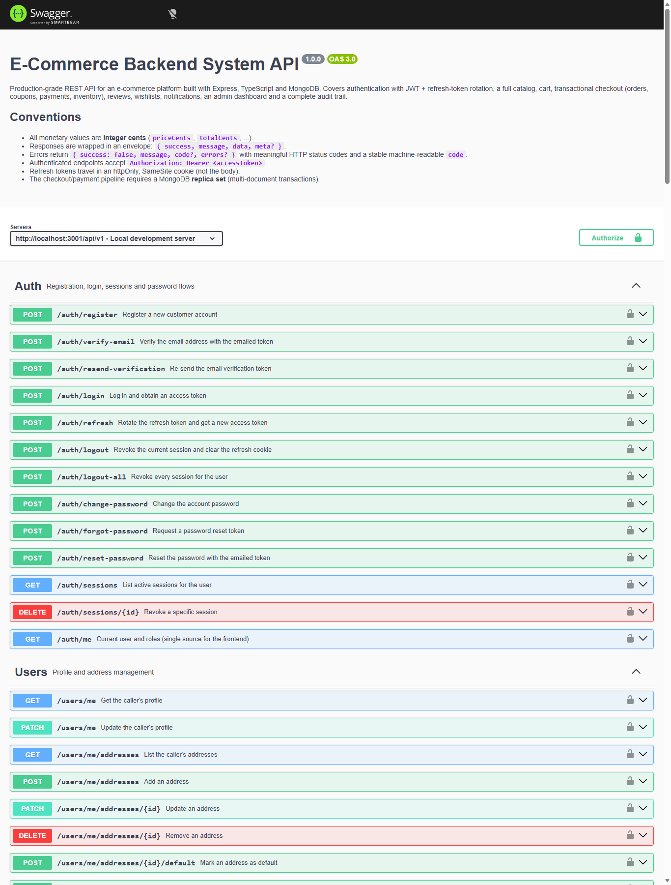
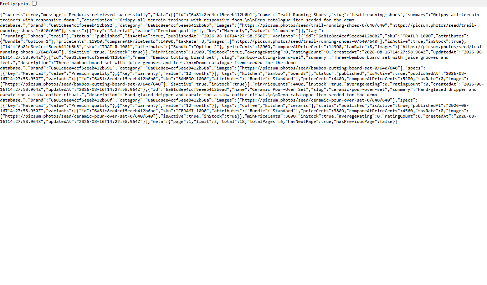
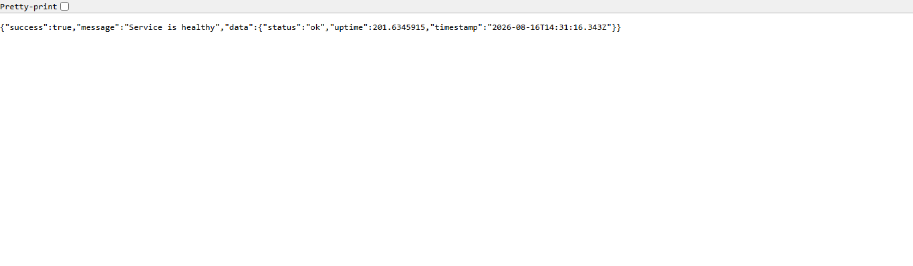

<div align="center">

# E-Commerce Backend System

**A production-grade, secure REST API platform for e-commerce — built with Express, TypeScript and MongoDB**


**Live API** → [`https://ecommerce-backend-ten-zeta.vercel.app`](https://ecommerce-backend-ten-zeta.vercel.app) · **Interactive docs** → [`/api/v1/docs`](https://ecommerce-backend-ten-zeta.vercel.app/api/v1/docs)

</div>

---

## Table of contents

- [Overview](#overview)
- [Screenshots](#screenshots)
- [Key features](#key-features)
- [Architecture](#architecture)
- [Tech stack](#tech-stack)
- [Features by module](#features-by-module)
- [Quick start](#quick-start)
- [Demo accounts](#demo-accounts)
- [Testing](#testing)
- [Scripts](#scripts)
- [Environment](#environment)
- [Deployment](#deployment)
- [Roadmap](#roadmap)

---

## Overview

A from-scratch reference implementation of the complete commerce lifecycle: **authentication with
JWT + refresh-token rotation**, a **searchable product catalog**, a **transactional checkout
pipeline** (orders → coupons → payments → inventory), reviews, wishlists, notifications, an admin
dashboard and a complete audit trail — exposed through **25+ RESTful endpoints** across 13 feature
modules.

Every module is covered by integration tests that run against a real in-memory MongoDB replica set,
with continuous integration running on every push to `main`.

## Screenshots

### Interactive API reference (Swagger UI)

The OpenAPI specification is served as interactive documentation at `/api/v1/docs` — every endpoint
can be executed directly from the browser.



### Live API responses

All responses follow a consistent envelope: `{ success, message, data, meta? }`, with money stored
as integer cents to avoid floating-point errors.





## Key features

- **Transactional checkout** — order creation, stock reservation and payment confirmation run inside
  MongoDB **multi-document transactions** (replica-set required). Stock is never double-sold and all
  money math uses integer cents.
- **Secure auth by default** — **bcrypt (cost 12)** password hashing, JWT access tokens with
  **refresh-token rotation and reuse detection** (a replayed token revokes the entire session
  family), `httpOnly`/`SameSite` cookies, per-endpoint rate limiting, and account lockout after
  repeated failures.
- **Role-based access control** — `CUSTOMER`, `SELLER`, `SUPPORT`, `ADMIN` roles enforced by
  middleware against the database on every request (not just the token).
- **Webhook-ready payments** — a provider abstraction (mock + real) with HMAC-SHA256-signed
  webhooks. Webhooks verify signatures, deduplicate by event id, and converge on the same
  event-handling path as the synchronous (auto-approve) flow.
- **Inventory accounting** — immutable stock movement ledger with restock / reserve / release /
  deduct operations, low-stock thresholds, and atomic reservation from the order pipeline.
- **Audit trail** — every security- and money-relevant action is recorded with actor, target, IP and
  metadata, reviewable by admins.
- **API-first** — interactive OpenAPI 3.0 docs served at `/api/v1/docs` (Swagger UI), validated
  request schemas via Zod.

## Architecture

```
┌──────────────┐      ┌─────────────────────┐      ┌───────────────────────────┐
│  Clients     │ ───▶ │  Vercel Edge        │ ───▶ │  Render (origin)          │
│  Web / App / │      │  Gateway            │      │  Express 5 + TypeScript   │
│  API tools   │      │  api/index.ts       │      │  src/core/app.ts          │
└──────────────┘      └─────────────────────┘      └────────────┬──────────────┘
                                                                 │
                                                     ┌────────────▼──────────────┐
                                                     │  MongoDB replica set      │
                                                     │  (transactions, indexes)  │
                                                     └───────────────────────────┘
```

```
src/
├── config/          env parsing (validated), logger, database connection
├── core/            app factory, middleware (auth, authorize, rate-limit), routers, docs
├── modules/         feature modules (auth, catalog, inventory, cart, order, coupon,
│                    payment, review, wishlist, notification, user, admin)
│   └── <module>/    routes.ts · controller.ts · service.ts · validators.ts · *.model.ts
├── scripts/         seed-data.ts (demo data), seed.ts (CLI runner)
└── shared/          errors, response envelope, middleware, utils (audit, money, slugify)
```

- **Layered modules** — `routes → controller → service → model`. Controllers stay thin; business
  rules, validation and transactions live in services.
- **Single mutation path for money** — order, payment and inventory changes converge through
  `order.service` and `payment.service` side-effect functions, each running inside a transaction.
- **App factory** — `createApp()` returns an isolated Express instance, which is what lets the test
  suite spin up a clean app per test file.

## Tech stack

| Layer      | Choice                                                         |
| ---------- | -------------------------------------------------------------- |
| Runtime    | Node.js 20+, TypeScript (strict), ESM                          |
| Framework  | Express 5                                                      |
| Database   | MongoDB via Mongoose 9 (replica set for transactions)          |
| Auth       | bcrypt (cost 12), `jose` (JWT), refresh-token rotation         |
| Validation | Zod (request body / query / params schemas)                    |
| Testing    | Vitest + Supertest + mongodb-memory-server                     |
| Quality    | ESLint (strict TS), Prettier, `tsc --noEmit`                   |
| Security   | helmet, CORS allow-list, request size caps, rate limiting      |
| Observability | pino structured logging, request ids                         |
| Deploy     | Render (origin), Vercel (edge gateway), GitHub Actions (CI)    |

## Features by module

- **Auth & users** — register, email verification, login/logout/all, password change + reset,
  session listing/revocation, profile and address book, account deactivation, admin user management.
- **Catalog** — full-text search, category/brand filters, price/rating filtering, sorting, slug and
  id lookups; admin CRUD for products (variants, SKUs, pricing, tax), categories and brands.
- **Inventory** — restock / adjust / reserve / release / deduct movements with an immutable ledger,
  low-stock reporting, and atomic reservation from the order pipeline.
- **Cart** — per-user cart with server-authoritative pricing and stock availability checks at
  add-time.
- **Orders** — coupon-aware checkout, fulfillment state machine
  (`pending → confirmed → processing → shipped → delivered`), customer cancellation and refund
  requests, staff transitions and filtering.
- **Coupons** — percentage/fixed discounts, scoped to `all` / `category` / `product`, min-order and
  max-discount caps, per-user limits, checkout validation.
- **Payments** — provider abstraction, checkout, refunds (partial supported), signed webhooks with
  orphan/duplicate handling, mock auto-approve for development.
- **Reviews** — verified-purchase auto-approval, moderation queue, per-product rating aggregates.
- **Wishlist & notifications** — personal wishlist; in-app notifications for order/review events.
- **Admin** — dashboard summary, per-product performance, audit log browser.

## Quick start

### Option A — demo mode (no database required)

The app can boot an **embedded in-memory MongoDB replica set** and auto-seed demo data, so you can
see the whole system working in seconds:

```powershell
npm install
$env:USE_IN_MEMORY_DB        = "true"
$env:PAYMENT_PROVIDER        = "mock"
$env:PAYMENT_MOCK_AUTO_APPROVE = "true"
npm run dev
```

The server listens on **`http://localhost:3001`**. Open the interactive API docs:

```
http://localhost:3001/api/v1/docs
```

Demo mode reseeds on every restart: 5 categories, 6 brands, 18 products and two accounts
(see [Demo accounts](#demo-accounts)). Data is ephemeral by design.

### Option B — full stack with Docker

```bash
npm install
cp .env.example .env

# 1. Start a single-node MongoDB replica set (transactions require it)
docker compose up -d mongo

# 2. Run the API (tsx watch, listens on :3001)
npm run dev

# 3. Optional: seed demo data into the persistent database
npm run seed
```

`docker compose up -d mongo` starts a replica set named `rs0` — the default `DATABASE_URL` in
`.env.example` already points at it. The mock payment provider auto-approves payments
(`PAYMENT_MOCK_AUTO_APPROVE=true`), so you can exercise the full checkout without a real gateway.

## Demo accounts

| Role     | Email               | Password    |
| -------- | ------------------- | ----------- |
| Customer | `demo@demo.com`     | `Demo123!`  |
| Admin    | `admin@demo.com`    | `Admin123!` |

Suggested walkthrough in Swagger UI:

1. `POST /auth/login` as `demo@demo.com` → copy the `accessToken` → **Authorize**
2. `GET /products` → browse the seeded catalog
3. `POST /cart` → `{ "productId": "<id>", "variantId": "<variant id>", "quantity": 1 }`
4. `POST /orders` → creates an order from the cart (include a `shippingAddress`)
5. `POST /payments/checkout` → mock payment auto-approves → order becomes `paid`

## Testing

The suite boots a real (in-memory) single-node MongoDB **replica set**, wipes data between tests
while keeping indexes, and runs test files serially against one shared database.

```bash
npm test           # run the integration suite (vitest run)
npm run typecheck  # strict TypeScript check
npm run lint       # ESLint
```

Coverage areas: auth flows (registration, verification, login, refresh rotation + reuse detection,
RBAC), catalog visibility/search/RBAC, and the full checkout pipeline (cart → order → payment →
fulfillment, refund + restock) including signed webhook processing.

## Scripts

| Command                | Description                                |
| ---------------------- | ------------------------------------------ |
| `npm run dev`          | Run with hot reload (`tsx watch`)          |
| `npm run seed`         | Seed demo data (requires a connected DB)   |
| `npm run build`        | Compile TypeScript to `dist/`              |
| `npm start`            | Run the compiled server                    |
| `npm test`             | Integration tests (`vitest run`)           |
| `npm run typecheck`    | `tsc --noEmit`                             |
| `npm run lint`         | ESLint across the repo                     |
| `npm run format:check` | Prettier check (src)                       |

## Environment

All configuration is validated at startup against `.env.example`. Notable variables:

| Variable                    | Purpose                                         |
| --------------------------- | ----------------------------------------------- |
| `DATABASE_URL`              | MongoDB URI — **must include `replicaSet=`**    |
| `USE_IN_MEMORY_DB`          | `true` → embedded in-memory replica set, no DB needed (demo) |
| `JWT_ACCESS_SECRET` / `JWT_REFRESH_SECRET` | Token signing secrets (use `openssl rand -hex 48`) |
| `CORS_ORIGIN`               | Comma-separated allow-list (production only)    |
| `PAYMENT_PROVIDER`          | `mock` (dev/test)                               |
| `PAYMENT_MOCK_AUTO_APPROVE` | `true` settles mock payments immediately        |
| `PAYMENT_WEBHOOK_SECRET`    | HMAC secret shared with the gateway             |
| `ALLOW_MOCK_AUTO_APPROVE_IN_PRODUCTION` | Demo-only opt-in (production guard) |

## Deployment

- The API deploys to **Render** as a Docker container (`render.yaml` blueprint). The live origin runs
  the **Java 21 / Spring Boot port** (`java/`) — a drop-in replacement for this TypeScript app with
  the same endpoints, env-var contract and behaviour. A **Vercel edge gateway** (`api/`) provides the
  public entry point, proxies to the origin and terminates CORS at the edge.
- Set `NODE_ENV=production` — enables `trust proxy` (correct client IPs behind a reverse proxy) and
  enforces the CORS allow-list.
- Generate fresh secrets; never ship the `.env.example` placeholders. In production the app refuses
  to boot with placeholder secrets or with mock auto-approve enabled (unless
  `ALLOW_MOCK_AUTO_APPROVE_IN_PRODUCTION=true` is set explicitly — a demo-only escape hatch).

Full platform-by-platform instructions (Render, Vercel gateway, Docker) live in
[`docs/DEPLOYMENT.md`](docs/DEPLOYMENT.md).

## Roadmap / possible extensions

- Order/refund webhooks delivered to the merchant via outbound queues (BullMQ / RabbitMQ)
- File uploads (S3/Cloudflare R2) for product images with signed URLs
- Search with proper tokenization and facets (Meilisearch / Atlas Search)
- Email provider integration (SES/Postmark) for transactional mail

---

Built as a portfolio project. API reference, architecture decisions and the module-by-module
implementation are all documented in the repository.
